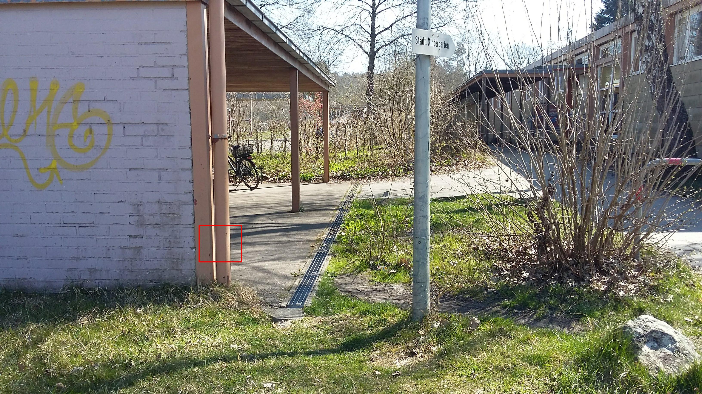

# Eine kleine Schatzsuche durch Wangen

Da im Moment die Kita geschlossen ist, habe ich mir überlegt eine kleine Schatzsuche für die Kitakinder zu gestalten. Diese funktioniert mit **QR-Codes**. Ihr braucht also für die Schatzsuche eine Handy und einen QR-Code Leser. Davon gibt es eine große Auswahl im AppStore. Die Schatzsuche funktioniert folgendermaßen: Ihr sucht den kleinen QR-Code, scannt ihn und geht zu der angezeigten Website. Dort bekommt ihr dann den nächsten Hinweis (oder mehrer Hinweise). Und so weiter. Versucht erstmal nicht die zusätzlichen Hinweise anzuschauen. Da die meisten Kinder noch nicht lesen können, erzähle ich meistens etwas oder zeige Bilder. Aber jetzt möchte ich euch nicht länger aufhalten. Hier findet ihr den ersten Code.

